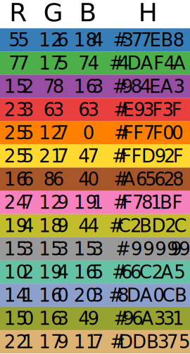

# SciPlotLib

A toolbox for drawing figures commonly found in journal or conference papers.

URL: https://github.com/MetaVisionLab/SciPlotLib

# Install

## Install Package

```shell script
git clone https://github.com/MetaVisionLab/SciPlotLib.git
cd SciPlotLib
python setup.py install
```

## Install Font

If you don't have the Times-New-Roman font in your system, you need to install it manually. For example, in Ubuntu 18.04, you can use the following command:

```shell script
cp ./fonts/* /path/to/your/python/site-packages/matplotlib/mpl-data/fonts/ttf/
```

And then, remove the cache of matplotlib.

```shell script
rm ~/.cache/matplotlib -rf
```

# Usage

All sample images are generated by the test function with the same name in the test folder. Users can refer to the corresponding code to prepare their own data and then call the corresponding function.

Due to the lack of compatibility of the SVG format, we do not generate SVG directly but generate PDF. The image can be inserted directly into LaTeX documents. If you want to insert the image into Word or PowerPoint, you can use Illustrator to extract the SVG from the PDF.

# Additional Information

## Color Map

By default, we use the following color map for scatter plot:

|  R  |  G  |  B  |    H     |
|:---:|:---:|:---:|:--------:|
| 55  | 126 | 184 | #377EB8  |
| 77  | 175 | 74  | #4DAF4A  |
| 152 | 78  | 163 | #984EA3  |
| 233 | 63  | 63  | #E93F3F  |
| 255 | 127 |  0  | #FF7F00  |
| 255 | 217 | 47  | #FFD92F  |
| 166 | 86  | 40  | #A65628  |
| 247 | 129 | 191 | #F781BF  |
| 194 | 189 | 44  | #C2BD2C  |
| 153 | 153 | 153 | #999999  |
| 102 | 194 | 165 | #66C2A5  |
| 141 | 160 | 203 | #8DA0CB  |
| 150 | 163 | 49  | #96A331  |
| 221 | 179 | 117 | #DDB375  |



